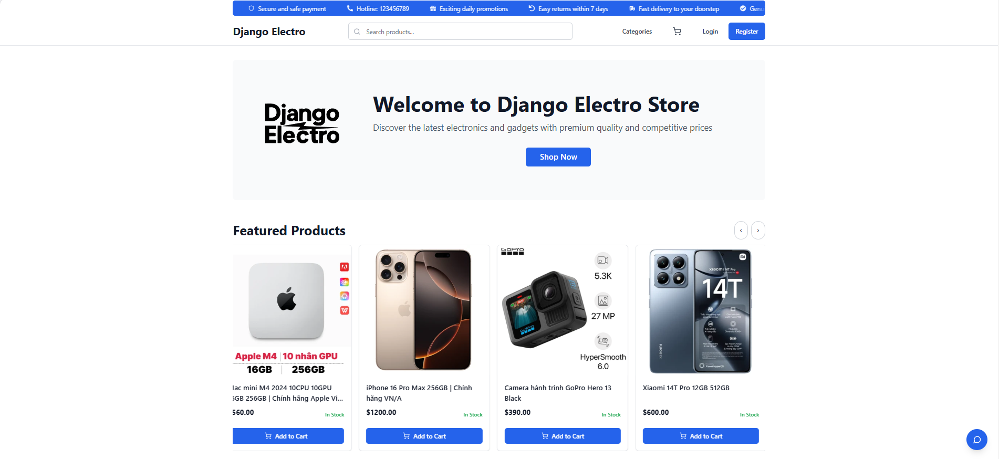
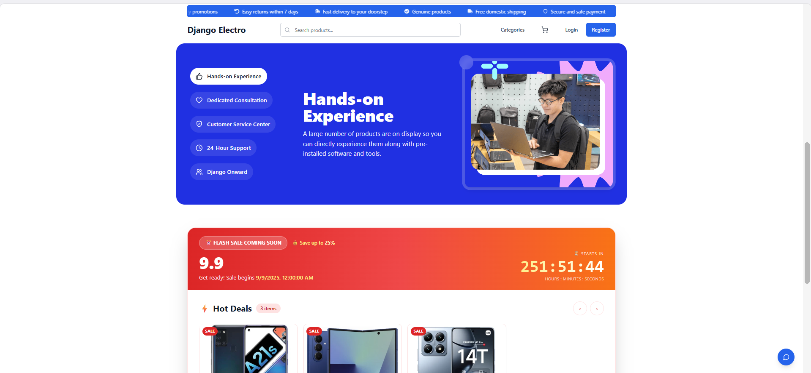
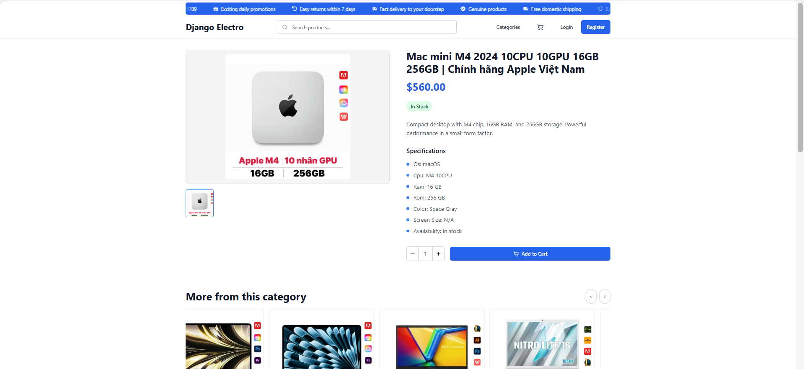
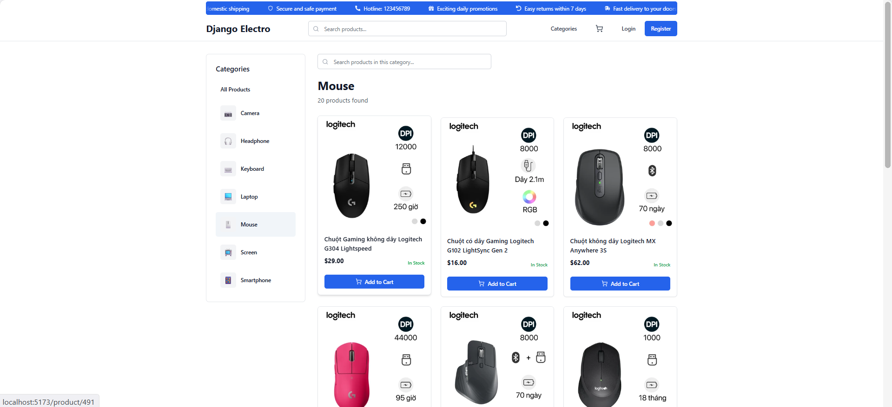
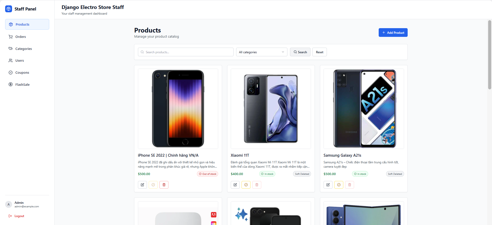
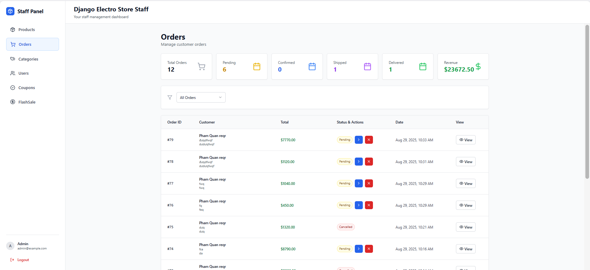
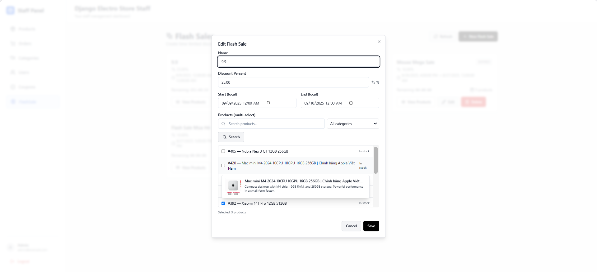

# Django Electro Store

A full-stack e-commerce platform built with Django REST Framework and React, designed for selling electronic devices and accessories.
## Showcase

**Homepage 1:**  


**Homepage 2:**  


**Product Detail:**  


**Categories:**  


**Admin – Products:**  


**Admin – Orders:**  


**Admin – Flash Sale:**  


**VideoShowcase:** 
https://github.com/user-attachments/assets/fbcdc0d5-9905-415e-8d81-f50b6add099d

## Technologies

### Backend
- Django 5.2.4
- Django REST Framework 3.16.0
- PostgreSQL
- Celery + Redis
- JWT Authentication

### Frontend
- React 18 + Vite
- TailwindCSS
- Radix UI
- Framer Motion
- React Router v6
- Axios

## Features

### User Features
- JWT Authentication with optional Google OAuth
- Product browsing by category with search and filters
- Price range filtering
- Product reviews and ratings
- Shopping cart and checkout
- Coupon code system
- Flash sales with countdown timers
- Order tracking

### Admin Features
- Product and category management with CRUD operations
- Coupon management system
- Flash sale scheduling with discount percentages
- Order management dashboard
- Soft delete functionality

## Project Structure

```
python-naitei25_ecommerce-2/
├─ accounts/               # User authentication (login, registration, social‑OAuth)
├─ cart/                   # Shopping‑cart logic and API endpoints
├─ core/                   # Base models, mixins, utilities shared across apps
├─ orders/                 # Order processing, coupons, flash‑sale scheduling
├─ products/               # Product catalog, categories, reviews
├─ users/                  # Extended user profile data (address, phone, etc.)
├─ config/                 # Django settings package (base/dev/prod)
├─ front_end/              # React + Vite source code
│   ├─ src/
│   ├─ public/
│   ├─ vite.config.ts
│   └─ .env               # Front‑end environment variables 
├─ .env                    # Back‑end environment variables 
└─ requirements.txt        # Python dependencies
```

## Setup and Installation

### Backend Setup

```bash
# Clone and navigate to repository
git clone https://github.com/awesome-academy/python-naitei25_ecommerce-2
cd python-naitei25_ecommerce-2

# Create and activate virtual environment
python -m venv venv
source venv/bin/activate  # Linux/macOS
# venv\Scripts\activate   # Windows

# Install dependencies
pip install -r requirements.txt

# Configure environment
cp .env.example .env
# Edit .env with your database URL and other settings

# Run migrations and create superuser
python manage.py migrate
python manage.py createsuperuser

# Start server
python manage.py runserver
```

### Frontend Setup

```bash
cd front_end
npm install
npm run dev
```

## Environment Configuration

Configure your `.env` file with:

```Back end env (in the PYTHON-NAITEI25_ECOMMERCE-2 Folder)
DB_ENGINE="django.db.backends.postgresql"

DB_PGSSLMODE='require'
DB_PGCHANNELBINDING='require'
SECRET_KEY=
DB_ENGINE=
DB_NAME=
DB_USER=
DB_PASSWORD=
DB_HOST=
DB_PORT=
SECRET_KEY=
DEBUG=

GOOGLE_CLIENT_ID=
GOOGLE_CLIENT_SECRET=
CORS_ALLOWED_ORIGINS=http://localhost:5173
GOOGLE_CALLBACK_URL=http://localhost:5173

EMAIL_HOST_PASSWORD=
EMAIL_DEFAULT=
EMAIL_PORT=
EMAIL_HOST=

CELERY_BROKER_URL =
CELERY_RESULT_BACKEND =
REVENUE_REPORT_DAY=
REVENUE_REPORT_HOUR=
REVENUE_REPORT_MINUTE=

ADMIN_EMAIL=
ADMIN_PASSWORD=
USER_EMAIL=
USER_PASSWORD=

Front end env (in the front_end folder)

VITE_GOOGLE_CLIENT_ID=
VITE_API_URL=http://localhost:8000
VITE_GOOGLE_AUTH_ENDPOINT=/dj-rest-auth/google/
VITE_LOGIN_ENDPOINT=/api/auth/login/
VITE_REGISTER_ENDPOINT=/api/auth/register/
VITE_CONTACT_PHONE=
VITE_CONTACT_EMAIL=
```
